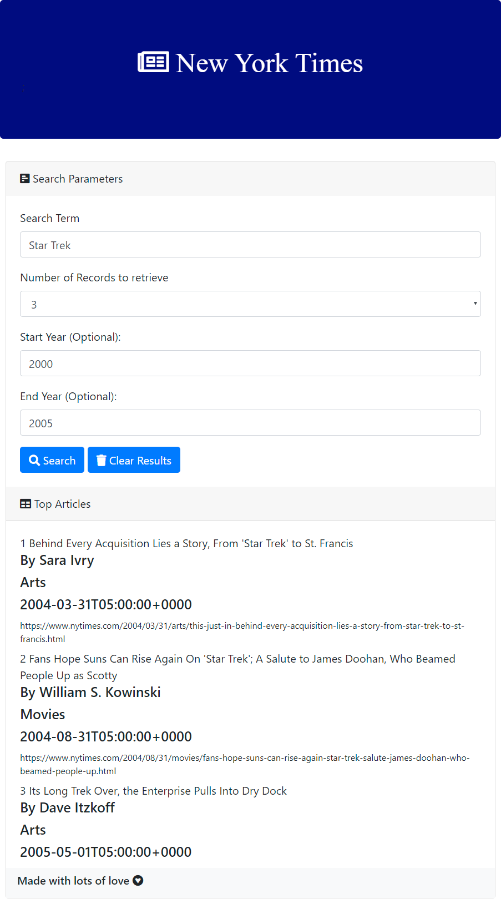
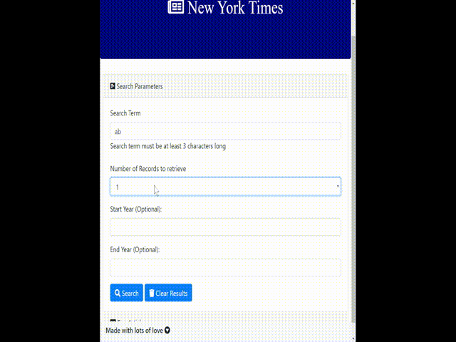

# NYTSearch

NYTSearch is an "intro to API integration" web app where users can enter a search term and query the _New York Times_ archive by setting year limits. 

The app itself was of little interest. However, I was able to incorporate JQueryValidate into the app to handle data field validations and works as a good demo case on how to use JQueryValidation on future projects. 

Visual work was done by Nadine Bundschuh with some participation by Rand Hunt. Backend and validation by Kasey Chang. 

## Project Repo

https://github.com/kschang77/NYTSearch

## Deployed Link

https://kschang77.github.io/NYTSearch/

## Screenshot

## Demo

# Built With

- Javascript
- Bootstrap 4
- jQuery
- FontAwesome
- NYT Search API

# Code Snippet

# Author

- **Kasey Chang**

- [Link to Github](https://kschang77.github.io)
- [Link to LinkedIn](https://www.linkedin.com/in/kasey-chang)

with assistance from Nadine Bundschuh and Rand Hunt

# License

This project is licensed under the MIT License

# Acknowledgments

Hat tip to Jerome, Kerwin, Mahi, and the UCBEx Coding Bootcamp March 2020 cohort
